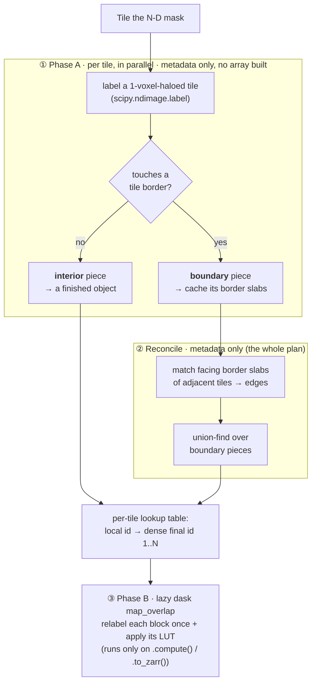

# tilewise-ccl

Fast tile-wise **connected-components labeling** for large N-dimensional arrays,
returning a lazy array of labels.

`tilewise_ccl.label_array` takes any large N-D binary mask (NumPy, Zarr, or Dask
backed) and returns a **lazy dask array** of connected-component labels, computed
with a tile-local labeling pass plus a small global boundary-piece graph. It is:

- **Fast**: only the pieces that touch a tile border are reconciled, on a small graph, so the
  cost stays low even as the number of tiles grows.
- **N-dimensional**: 2D, 3D, or higher; connectivity is configurable.
- **Storage- and domain-agnostic**: no OME-Zarr / image-format dependency; just
  NumPy + SciPy + Dask.
- **Dask-optional**: the `dyna` backend (see [Backends](#backends)) runs the whole
  thing through [dyna-zarr](https://github.com/bugraoezdemir/dyna_zarr)'s pull model
  instead - no task graph, and it fuses a preceding threshold into each tile read.
- **Memory-bounded**: peak memory scales with `(tile size) × (concurrency)`, not
  with the array size, so it labels arrays far larger than RAM.
- **Composable**: the result is a genuine lazy dask array, so it plugs straight
  into other dask operations, such as `da.unique`, slicing, arithmetic, `.to_zarr(...)`, region-property
  computation, etc.

Labels are **dense integers `1..N`** (background `0`), `int32` when `N < 2**31`
(essentially always) else `int64`.

---

## Installation

```bash
pip install tilewise-ccl
# or, from a checkout:
pip install -e .
```

Requires Python ≥ 3.11 and `numpy`, `scipy`, `dask`.

Optional extras, each needed only by the feature that names it:

```bash
pip install "tilewise-ccl[dyna]"   # backend="dyna": pull-model tile reads, no dask graph
pip install "tilewise-ccl[cc3d]"   # labeler="cc3d": a faster per-tile CCL kernel (3-D)
pip install "tilewise-ccl[all]"    # both
```

Each is imported lazily at the point of use, so a plain install stays light and
only raises - naming the extra - if you reach for that feature without it.

---

## Quick start

`label_array` expects a **binary mask** (anything truthy is foreground). Threshold
your data first, then label:

```python
import numpy as np
from tilewise_ccl import label_array

# any N-D array; truthy = foreground
image = np.random.default_rng(0).integers(0, 100, size=(512, 512), dtype=np.uint8)
mask = image > 80

labels = label_array(mask, tile_shape=(256, 256), connectivity=2)

labels                      # lazy dask.array.Array, dtype int32, shape (512, 512)
result = labels.compute()   # materialize to a NumPy array of labels 1..N

# opt in to diagnostics (object/graph counts, timings) -> returns a tuple
labels, diag = label_array(mask, tile_shape=(256, 256), connectivity=2, diagnostics=True)
print(diag["n_final_objects"])
```

### On a Dask array (e.g. a large Zarr / OME-Zarr level)

The input can be lazy. `label_array` reads it tile by tile, so nothing needs to
fit in memory at once. Note the labeling is *not* forced until you compute or
write the result.

```python
import dask.array as da
from tilewise_ccl import label_array

# read one array directly from a zarr store (no OME-Zarr machinery needed)
arr = da.from_zarr("dataset.zarr/0")     # e.g. a huge 3D volume, uint8/uint16
mask = arr > 128                          # lazy boolean mask

labels = label_array(mask, tile_shape=(384, 384, 384), connectivity=2, n_workers=8)

# the result is lazy. Stream it straight to disk (each chunk written once)
labels.to_zarr("labels.zarr", overwrite=True)
```

### The same, without dask (the `dyna` backend)

The identical job through [dyna-zarr](https://github.com/bugraoezdemir/dyna_zarr)'s
pull model - no task graph anywhere. Install the `[dyna]` extra. Labels are
byte-identical to the dask path; only the execution differs. See
[Backends](#backends) for what changes and why.

```python
from dyna_zarr.io import io as dio
from tilewise_ccl import label_array

# read one array directly from a zarr store, exactly as above
arr = dio.read("dataset.zarr/0")          # a DynamicArray, not a dask array
mask = arr > 128                          # lazy - and FUSED into each tile read

# backend is inferred from the mask type - a DynamicArray selects the dyna path
labels = label_array(mask, tile_shape=(384, 384, 384), connectivity=2, n_workers=8)

# the result is a lazy DynamicArray - write it with dyna-zarr's writer, which
# picks up the tile grid automatically (see the note below).
dio.write(labels, "labels.zarr", chunks=(96, 96, 96),
          max_workers=8, overwrite=True)
```

Two differences worth noting against the dask version above:

- **The threshold costs nothing extra.** `arr > 128` is never materialized - each
  tile applies the comparison as it is pulled, so there is no intermediate mask
  array on disk and no per-tile scheduler overhead.
- **The writer follows the tile grid on its own.** `label_array` records its
  `tile_shape` on the returned array, and `dio.write` reads it, so the write
  regions line up with the tiles and each tile is read and labeled exactly once.
  You do not have to restate the tiling. (`chunks` is separate and can stay small
  for fast downstream reads.)

### Downstream composability

The labeling is lazy, and so is everything you build on it. A useful consequence:
`properties=True` gives you every object's size and bounding box as **metadata**,
without a pass over the data - so you can find an object of interest and then
read back only the box it occupies.

```python
import numpy as np

labels, diag = label_array(mask, tile_shape=(128, 128, 128), connectivity=2,
                           n_workers=8, properties=True)

# area / bbox come from the per-tile pass - no extra read of the array
i    = int(np.argmax(diag["area"]))          # the largest object
lbl  = int(diag["label_values"][i])
lo, hi = diag["bbox_start"][i], diag["bbox_stop"][i]

# read back ONLY that object's bounding box (.compute() works on both backends)
crop = labels[tuple(slice(int(a), int(b)) for a, b in zip(lo, hi))].compute()
obj  = crop == lbl                            # the object itself, isolated
```

Only the box is ever materialized. The rest of the array is never touched.

The same laziness applies to ordinary array work:

```python
import dask.array as da

# count objects an independent way (excludes background 0)
n_objects = int(np.count_nonzero(da.unique(labels).compute()))

# match the storage chunking before writing (cheap when tile_shape is a
# multiple of the target chunk, e.g. 384 = 4 * 96)
labels.rechunk((96, 96, 96)).to_zarr("labels.zarr", overwrite=True)
```

---

## API

### `label_array(mask, tile_shape=None, connectivity=2, n_workers=1, diagnostics=False, properties=False, verbose=False, backend="auto", executor="thread", labeler="scipy")`

Label connected components of a binary N-D mask into a lazy dask array.

**Returns:**

- **By default** (`diagnostics=False`): just `output_labels`, a lazy array of
  dense labels `1..N` (background `0`), same shape as `mask`. dtype is `int32`
  when `N < 2**31`, else `int64`. It is a `dask.array.Array` with the default
  `backend="dask"`, and a `dyna_zarr` `DynamicArray` with `backend="dyna"`.
- **With `diagnostics=True`**: a tuple `(output_labels, diag)`, where `diag` is a
  `dict` of object/graph counts and timings (see below).

```python
labels = label_array(mask)                          # -> dask.array.Array
labels, diag = label_array(mask, diagnostics=True)  # -> (dask.array.Array, dict)
```

#### Parameters

| Parameter | Type | Default | Description |
|---|---|---|---|
| `mask` | `np.ndarray` \| `dask.array.Array` \| `zarr.Array` | *required* | N-D array; truthy elements are foreground. Read tile by tile, so it may be far larger than RAM. |
| `tile_shape` | sequence of int | `None` | Size of each processing tile, **one entry per dimension** (its length must equal `mask.ndim`). `None` derives one from the mask: a ~256 MiB working set over the trailing 3 (spatial) axes, snapped to whole storage chunks when the mask exposes `.chunks`, leading (t/c-like) axes left at 1. This is an *execution hyperparameter* and does not change the result. See [Choosing `tile_shape`](#choosing-tile_shape). |
| `connectivity` | int | `2` | Passed to `scipy.ndimage.generate_binary_structure(ndim, connectivity)`. Higher = more diagonal neighbors are considered connected (see [Connectivity](#connectivity)). |
| `n_workers` | int | `1` | If `> 1`, the eager metadata pass (Phase A) runs over tiles via a thread pool. Each tile touches only its own region, so this is safe. Phase B (the lazy graph) is scheduled by Dask when you compute/write the result. |
| `diagnostics` | bool | `False` | If `True`, also return a `diag` dict (the function returns a `(labels, diag)` tuple instead of just `labels`). |
| `properties` | bool | `False` | Also compute per-object `area` (voxel count) and `bbox_start`/`bbox_stop` (half-open global bounding box) into `diag` - implies returning the tuple. Aggregated from per-tile partials, so memory stays bounded by tile size no matter how large an object is. |
| `backend` | `"auto"` \| `"dask"` \| `"dyna"` | `"auto"` | Execution backend. `"auto"` infers it from the mask type - a `DynamicArray` gets the dyna path, anything else gets dask - so you rarely pass this. See [Backends](#backends). |
| `executor` | `"thread"` \| `"process"` | `"thread"` | Pool type for Phase A. Which one wins depends entirely on `backend` - see [Backends](#backends). |
| `labeler` | `"scipy"` \| `"cc3d"` | `"scipy"` | Per-tile CCL kernel. `"cc3d"` (needs the `[cc3d]` extra, 3-D only) is ~2x faster per call but **holds the GIL**, so it only pays off with `executor="process"`. Both emit identical labels. |
| `verbose` | bool | `False` | Print per-tile progress for Phase A (immediately) and Phase B (when the returned array is computed/written). |

> **Note.** `tile_shape` must have the same length as `mask.ndim`; a mismatch
> raises `ValueError`.

#### `diag` fields (returned only when `diagnostics=True`)

| Key | Meaning |
|---|---|
| `n_tiles`, `grid_shape` | Number of tiles and the tile-grid shape. |
| `n_final_objects` | Total number of connected components (== `N`). |
| `n_interior_objects` | Objects fully contained in a single tile (resolved locally, never entered the graph). |
| `n_boundary_pieces`, `n_edges`, `n_boundary_groups` | Size of the boundary-reconciliation graph: pieces touching a tile border, edges between them, and the resulting merged groups. |
| `n_objects_single_tile` | Objects occupying exactly one tile (do **not** cross a tile border). |
| `n_objects_crossing` | Objects that cross into ≥2 tiles. |
| `n_objects_crossing_gt3_tiles` | Objects spanning >3 tiles (large objects). |
| `max_tiles_spanned` | Maximum number of tiles any single object spans. |
| `output_dtype` | dtype of `output_labels` (`"int32"` or `"int64"`). |
| `time_phaseA_s`, `time_reconcile_s`, `time_total_s` | Eager-phase timings (seconds). Phase B's cost is incurred later, on compute/write. |

---

## Connectivity

`connectivity` selects the neighborhood via
`scipy.ndimage.generate_binary_structure(ndim, connectivity)`. An offset counts
as a neighbor iff its number of nonzero components is `≤ connectivity`:

| ndim | `connectivity=1` | `connectivity=2` | `connectivity=3` |
|---|---|---|---|
| 2D | 4-connected (faces) | 8-connected (+ corners) | n/a |
| 3D | 6-connected (faces) | 18-connected (+ edges) | 26-connected (+ corners) |

Cross-tile connections (including diagonal corner/edge crossings between tiles)
are handled correctly for every connectivity, so the label result is identical to
a single whole-array `scipy.ndimage.label`, independent of `tile_shape`.

---

## Choosing `tile_shape`

`tile_shape` is a pure performance/parallelism knob and does **not** affect the
result. Guidance:

- **Bigger tiles** → more objects fit entirely inside one tile → fewer boundary
  pieces → smaller reconciliation graph and less per-tile overhead. The cost is
  more memory per tile (one `scipy.ndimage.label` call on a haloed tile) and
  coarser parallelism.
- **The default is usually fine.** With `tile_shape=None`, `label_array` targets a
  ~256 MiB int32 working set over the trailing three axes and snaps it to whole
  storage chunks, so the tile is always a chunk multiple and no chunk is read
  twice. On a 3-D array chunked at `96³` that lands on `384³`; on a 5-D
  `(t, c, z, y, x)` it tiles `z/y/x` only and leaves `t`/`c` at 1.
- Override it when you have memory to spare. Peak RSS is roughly **2x the tile's
  int32 size, per worker** (measured), so a `512³` tile costs ~1 GiB per worker -
  8 GiB at `n_workers=8`. Bigger tiles mean fewer boundary pieces and a smaller
  reconciliation graph, at that cost.
- It is **decoupled from storage chunking**: `label_array` reads whatever tile
  size you ask for directly, regardless of how the data is chunked on disk, so
  there is no need to `rechunk` the input first. This keeps it efficient even on
  natively small-chunked data.
- If you write the result with `.to_zarr`, keep the output chunk shape a divisor
  of `tile_shape` (e.g. tile `384`, chunks `96`) so the pre-write `rechunk` is a
  cheap sub-slice rather than a cross-block shuffle.

Peak memory is roughly `n_workers × (tile voxels) × (a few bytes)`. Set
`tile_shape` and `n_workers` to fit your memory budget.

---

## How it works: interior–boundary reconciliation

`tilewise-ccl` is a **tile-wise** connected-components labeler: label each tile on its
own, then merge the components that meet across tile borders. It adapts that
classic idea with two moves that keep it fast and memory-bounded:

**1. Interior–boundary separation** shrinks what must be reconciled. A
component touching none of its tile's borders is already a finished object and is
set aside at once. Only components touching a border (the ones that might continue
into a neighbour) are reconciled. So the global step is a small graph over
**border pieces**, whose size tracks the tiles' seam area, not the object count,
and stays flat as the number of tiles grows.

**2. Plan first, materialize once** defers ever touching the data. The first
pass reads each tile but keeps only compact **metadata** (which pieces merge, plus
a per-tile lookup table) and allocates **no output array**. The labels are a lazy
dask graph that materializes exactly once, on `.compute()` / `.to_zarr(...)`,
relabelling each block in a single pass. Peak memory scales with tile size ×
concurrency (a handful of tiles), never the whole array, and **no voxel is written
twice**.

In short: most objects sit inside a single tile and are finished there (cheap);
only the few that straddle a **seam** between tiles ever need the reconciliation
graph.

### The two phases



1. **Phase A** (eager, one tile at a time, in parallel; metadata only). Read a
   1-voxel-haloed tile and label it with `scipy.ndimage.label`. Split its
   components into **interior** (touch no border → finished) and **boundary**
   (touch a border → deferred, their border slabs cached). Only small per-tile
   metadata is kept (never voxel data), so memory is bounded by
   `tile size × n_workers` and the pass runs safely across a thread pool. **No
   output array is allocated.**

2. **Reconcile** (metadata only). Compare the facing border slabs of adjacent
   tiles (faces, plus edge/corner diagonals for higher connectivity); where
   foreground meets foreground, link the two boundary pieces. A union-find over
   those pieces merges them into whole objects, and each tile gets a lookup table
   from its local ids to dense final ids `1..N`. This little plan is the *entire*
   global result.

3. **Phase B** (lazy; materialize once). A `dask.array.map_overlap` relabels each
   block and applies that tile's lookup table, emitting final labels directly, **with no
   read-modify-write of an output buffer**. Nothing runs until you `.compute()` or
   `.to_zarr(...)`, and each chunk is produced exactly once.

Because most objects are interior, the reconciliation graph is pure metadata over
border pieces, and the array is only ever built lazily, cost stays low even for
pathological inputs: an object spanning hundreds of tiles still reconciles in well
under a second.

---

## Backends

`backend` selects how tiles are READ and how Phase B is expressed. Both produce
byte-identical labels - it is purely an execution choice.

### `backend="auto"` (default)

Picks `"dyna"` when `mask` is a `dyna_zarr` `DynamicArray`, `"dask"` otherwise. The
mask type already determines which path is viable - the dyna path accepts nothing
else - so the backend is normally not worth stating. Pass it explicitly only to
force the dask path for a `DynamicArray` mask (which works: each tile is
materialized as it is pulled).

### `backend="dask"`

`mask` may be a NumPy, Zarr, or Dask array. Phase B is a `da.map_blocks` over the
mask, so the result is a genuine `dask.array.Array` that composes with the rest of
dask (see [Downstream composability](#downstream-composability)).

### `backend="dyna"`

Selected automatically when `mask` is a [dyna-zarr](https://github.com/bugraoezdemir/dyna_zarr)
`DynamicArray` (install the `[dyna]` extra). Phase A pulls each tile directly
through dyna's pull model, and Phase B is a native dyna `map_overlap` - **no dask
graph anywhere**. Two things make this fast:

- A lazy threshold is **fused into the tile read**. `io.read(path) > 128` is not
  materialized; each tile applies the comparison as it is pulled, so there is no
  separate mask array on disk and no scheduler overhead per tile.
- Reads are memory-bounded by construction: a tile pull reads exactly the region
  asked for.

The returned array is a lazy `DynamicArray`, so write it with dyna-zarr's writer
rather than `.to_zarr()` - see the [worked example above](#the-same-without-dask-the-dyna-backend).

Any `DynamicArray` works as the mask - however you obtained it, and with any
chain of lazy dyna operations already applied.

### Picking `executor`

`executor` only affects Phase A, and the right answer depends on the backend,
because the two differ in how much GIL-bound Python work a tile read costs.

Measured end to end on a 1024³ uint8 volume (1 GiB), 256³ tiles, 64³ output
chunks, 8 workers, best of 2. **Both backends write the same zarr v3 array with
the same blosc/zstd-5/bitshuffle codec** and produce byte-identical output
(82.6 MiB on disk in every row). Phase B is the lazy half, timed by writing:

| backend / executor | Phase A | Phase B (write) | total |
|---|---|---|---|
| `dask` / `thread` | 7.0 s | 12.8 s | 19.7 s |
| `dask` / `process` | **5.1 s** | 12.7 s | 17.8 s |
| `dyna` / `thread` | **2.8 s** | **8.2 s** | **11.0 s** |
| `dyna` / `process` | 4.4 s | 8.1 s | 12.5 s |

Reading it:

- **Phase B dominates** - roughly 65-75% of the run. It is mostly I/O and
  compression, and `executor` does not touch it.
- Within Phase A the rule holds: `process` helps `dask` (1.4x, its read goes
  through dask's graph and zarr's Python-level chunk assembly, which is
  GIL-bound), while `thread` wins for `dyna` (1.6x, it pulls tiles directly, so
  little GIL contention remains and per-tile pickling costs more than it saves).
- **The backend matters more than the executor.** `dyna`/`thread` is **1.8x** the
  `dask`/`thread` baseline overall, while switching executor moves the total by
  ~10%. Choose the backend first.

One machine's numbers; the direction generalizes, the ratios may not.

The mask is shipped to each worker **once** via the pool initializer, and lazy
masks (zarr / dask / dyna) pickle as small references, so no array data is copied.
Process pools fall back to threads automatically for an in-memory NumPy mask
(which *would* be copied per worker) and for grids too small to amortize start-up.

`labeler="cc3d"` follows the same logic: it is faster per call but holds the GIL,
so pair it with `executor="process"` or not at all.

---
