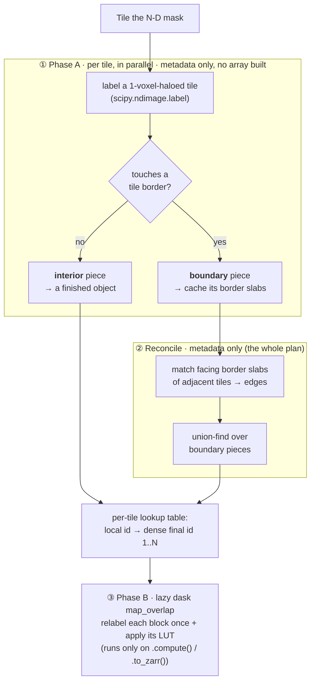

# ScaLabel

Fast tile-wise **connected-components labeling** for large N-dimensional arrays,
returning a lazy `dask.array.Array` of labels.

`scalabel.label_array` takes any large N-D binary mask (NumPy, Zarr, or Dask
backed) and returns a **lazy dask array** of connected-component labels, computed
with a tile-local labeling pass plus a small global boundary-piece graph. It is:

- **Fast**: only the pieces that touch a tile border are reconciled, on a small graph, so the
  cost stays low even as the number of tiles grows.
- **N-dimensional**: 2D, 3D, or higher; connectivity is configurable.
- **Storage- and domain-agnostic**: no OME-Zarr / image-format dependency; just
  NumPy + SciPy + Dask.
- **Memory-bounded**: peak memory scales with `(tile size) × (concurrency)`, not
  with the array size, so it labels arrays far larger than RAM.
- **Composable**: the result is a genuine lazy dask array, so it plugs straight
  into other dask operations, such as `da.unique`, slicing, arithmetic, `.to_zarr(...)`, region-property
  computation, etc.

Labels are **dense integers `1..N`** (background `0`), `int32` when `N < 2**31`
(essentially always) else `int64`.

---

## Installation

```bash
pip install scalabel
# or, from a checkout:
pip install -e .
```

Requires Python ≥ 3.9 and `numpy`, `scipy`, `dask`.

---

## Quick start

`label_array` expects a **binary mask** (anything truthy is foreground). Threshold
your data first, then label:

```python
import numpy as np
from scalabel import label_array

# any N-D array; truthy = foreground
image = np.random.default_rng(0).integers(0, 100, size=(512, 512), dtype=np.uint8)
mask = image > 80

labels = label_array(mask, tile_shape=(256, 256), connectivity=2)

labels                      # lazy dask.array.Array, dtype int32, shape (512, 512)
result = labels.compute()   # materialize to a NumPy array of labels 1..N

# opt in to diagnostics (object/graph counts, timings) -> returns a tuple
labels, diag = label_array(mask, tile_shape=(256, 256), connectivity=2, diagnostics=True)
print(diag["n_final_objects"])
```

### On a Dask array (e.g. a large Zarr / OME-Zarr level)

The input can be lazy. `label_array` reads it tile by tile, so nothing needs to
fit in memory at once. Note the labeling is *not* forced until you compute or
write the result.

```python
import dask.array as da
from scalabel import label_array

# read one array directly from a zarr store (no OME-Zarr machinery needed)
arr = da.from_zarr("dataset.zarr/0")     # e.g. a huge 3D volume, uint8/uint16
mask = arr > 128                          # lazy boolean mask

labels = label_array(mask, tile_shape=(303, 303, 303), connectivity=2, n_workers=8)

# the result is lazy. Stream it straight to disk (each chunk written once)
labels.to_zarr("labels.zarr", overwrite=True)
```

### Downstream composability

Because `labels` is a lazy dask array, you can build further computation on it
without recomputing the labeling more than the graph requires:

```python
import numpy as np
import dask.array as da

# count objects an independent way (excludes background 0)
n_objects = int(np.count_nonzero(da.unique(labels).compute()))

# slice / reduce lazily
corner_sum = int(labels[:64, :64, :64].sum().compute())

# match the storage chunking before writing (cheap when tile_shape is a
# multiple of the target chunk, e.g. 303 = 3 * 101)
labels.rechunk((101, 101, 101)).to_zarr("labels.zarr", overwrite=True)
```

---

## API

### `label_array(mask, tile_shape=None, connectivity=2, n_workers=1, diagnostics=False, verbose=False)`

Label connected components of a binary N-D mask into a lazy dask array.

**Returns:**

- **By default** (`diagnostics=False`): just `output_labels`, a lazy
  `dask.array.Array` of dense labels `1..N` (background `0`), same shape as
  `mask`. dtype is `int32` when `N < 2**31`, else `int64`.
- **With `diagnostics=True`**: a tuple `(output_labels, diag)`, where `diag` is a
  `dict` of object/graph counts and timings (see below).

```python
labels = label_array(mask)                          # -> dask.array.Array
labels, diag = label_array(mask, diagnostics=True)  # -> (dask.array.Array, dict)
```

#### Parameters

| Parameter | Type | Default | Description |
|---|---|---|---|
| `mask` | `np.ndarray` \| `dask.array.Array` \| `zarr.Array` | *required* | N-D array; truthy elements are foreground. Read tile by tile, so it may be far larger than RAM. |
| `tile_shape` | sequence of int | `None` | Size of each processing tile, **one entry per dimension** (its length must equal `mask.ndim`). `None` uses `(303,) * mask.ndim`, adapting to the input's dimensionality. This is an *execution hyperparameter*, independent of how the data is chunked in storage. See [Choosing `tile_shape`](#choosing-tile_shape). |
| `connectivity` | int | `2` | Passed to `scipy.ndimage.generate_binary_structure(ndim, connectivity)`. Higher = more diagonal neighbors are considered connected (see [Connectivity](#connectivity)). |
| `n_workers` | int | `1` | If `> 1`, the eager metadata pass (Phase A) runs over tiles via a thread pool. Each tile touches only its own region, so this is safe. Phase B (the lazy graph) is scheduled by Dask when you compute/write the result. |
| `diagnostics` | bool | `False` | If `True`, also return a `diag` dict (the function returns a `(labels, diag)` tuple instead of just `labels`). |
| `verbose` | bool | `False` | Print per-tile progress for Phase A (immediately) and Phase B (when the returned array is computed/written). |

> **Note.** `tile_shape` must have the same length as `mask.ndim`; a mismatch
> raises `ValueError`.

#### `diag` fields (returned only when `diagnostics=True`)

| Key | Meaning |
|---|---|
| `n_tiles`, `grid_shape` | Number of tiles and the tile-grid shape. |
| `n_final_objects` | Total number of connected components (== `N`). |
| `n_interior_objects` | Objects fully contained in a single tile (resolved locally, never entered the graph). |
| `n_boundary_pieces`, `n_edges`, `n_boundary_groups` | Size of the boundary-reconciliation graph: pieces touching a tile border, edges between them, and the resulting merged groups. |
| `n_objects_single_tile` | Objects occupying exactly one tile (do **not** cross a tile border). |
| `n_objects_crossing` | Objects that cross into ≥2 tiles. |
| `n_objects_crossing_gt3_tiles` | Objects spanning >3 tiles (large objects). |
| `max_tiles_spanned` | Maximum number of tiles any single object spans. |
| `output_dtype` | dtype of `output_labels` (`"int32"` or `"int64"`). |
| `time_phaseA_s`, `time_reconcile_s`, `time_total_s` | Eager-phase timings (seconds). Phase B's cost is incurred later, on compute/write. |

---

## Connectivity

`connectivity` selects the neighborhood via
`scipy.ndimage.generate_binary_structure(ndim, connectivity)`. An offset counts
as a neighbor iff its number of nonzero components is `≤ connectivity`:

| ndim | `connectivity=1` | `connectivity=2` | `connectivity=3` |
|---|---|---|---|
| 2D | 4-connected (faces) | 8-connected (+ corners) | n/a |
| 3D | 6-connected (faces) | 18-connected (+ edges) | 26-connected (+ corners) |

Cross-tile connections (including diagonal corner/edge crossings between tiles)
are handled correctly for every connectivity, so the label result is identical to
a single whole-array `scipy.ndimage.label`, independent of `tile_shape`.

---

## Choosing `tile_shape`

`tile_shape` is a pure performance/parallelism knob and does **not** affect the
result. Guidance:

- **Bigger tiles** → more objects fit entirely inside one tile → fewer boundary
  pieces → smaller reconciliation graph and less per-tile overhead. The cost is
  more memory per tile (one `scipy.ndimage.label` call on a haloed tile) and
  coarser parallelism.
- A good starting point is **a few times the storage chunk size** per axis (e.g.
  `303 = 3 × 101`), large enough that most objects are much smaller than a tile.
- It is **decoupled from storage chunking**: `label_array` reads whatever tile
  size you ask for directly, regardless of how the data is chunked on disk, so
  there is no need to `rechunk` the input first. This keeps it efficient even on
  natively small-chunked data.
- If you write the result with `.to_zarr`, keep the output chunk shape a divisor
  of `tile_shape` (e.g. tile `303`, chunks `101`) so the pre-write `rechunk` is a
  cheap sub-slice rather than a cross-block shuffle.

Peak memory is roughly `n_workers × (tile voxels) × (a few bytes)`. Set
`tile_shape` and `n_workers` to fit your memory budget.

---

## How it works: interior–boundary reconciliation

`scalabel` is a **tile-wise** connected-components labeler: label each tile on its
own, then merge the components that meet across tile borders. It adapts that
classic idea with two moves that keep it fast and memory-bounded:

**1. Interior–boundary separation** shrinks what must be reconciled. A
component touching none of its tile's borders is already a finished object and is
set aside at once. Only components touching a border (the ones that might continue
into a neighbour) are reconciled. So the global step is a small graph over
**border pieces**, whose size tracks the tiles' seam area, not the object count,
and stays flat as the number of tiles grows.

**2. Plan first, materialize once** defers ever touching the data. The first
pass reads each tile but keeps only compact **metadata** (which pieces merge, plus
a per-tile lookup table) and allocates **no output array**. The labels are a lazy
dask graph that materializes exactly once, on `.compute()` / `.to_zarr(...)`,
relabelling each block in a single pass. Peak memory scales with tile size ×
concurrency (a handful of tiles), never the whole array, and **no voxel is written
twice**.

In short: most objects sit inside a single tile and are finished there (cheap);
only the few that straddle a **seam** between tiles ever need the reconciliation
graph.

### The two phases



1. **Phase A** (eager, one tile at a time, in parallel; metadata only). Read a
   1-voxel-haloed tile and label it with `scipy.ndimage.label`. Split its
   components into **interior** (touch no border → finished) and **boundary**
   (touch a border → deferred, their border slabs cached). Only small per-tile
   metadata is kept (never voxel data), so memory is bounded by
   `tile size × n_workers` and the pass runs safely across a thread pool. **No
   output array is allocated.**

2. **Reconcile** (metadata only). Compare the facing border slabs of adjacent
   tiles (faces, plus edge/corner diagonals for higher connectivity); where
   foreground meets foreground, link the two boundary pieces. A union-find over
   those pieces merges them into whole objects, and each tile gets a lookup table
   from its local ids to dense final ids `1..N`. This little plan is the *entire*
   global result.

3. **Phase B** (lazy; materialize once). A `dask.array.map_overlap` relabels each
   block and applies that tile's lookup table, emitting final labels directly, **with no
   read-modify-write of an output buffer**. Nothing runs until you `.compute()` or
   `.to_zarr(...)`, and each chunk is produced exactly once.

Because most objects are interior, the reconciliation graph is pure metadata over
border pieces, and the array is only ever built lazily, cost stays low even for
pathological inputs: an object spanning hundreds of tiles still reconciles in well
under a second.

---

## Also available

- `scalabel.label_array_legacy(mask, output_labels, ...)`: an earlier *eager*
  implementation that writes into a pre-allocated output buffer (NumPy/Zarr)
  instead of returning a lazy array. Kept for comparison/benchmarking; prefer
  `label_array` for new code.
